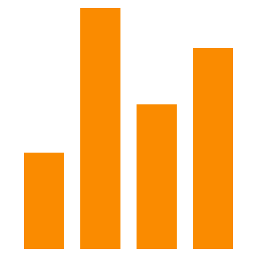

<!-- Streak Stats -->

##  Streak Stats

    
   
   

<!-- /Streak Stats -->

<!-- Waka Time -->

##  Yearly Coding Activity

  
   
   

<!-- /Waka Time -->

<!-- Github Stats -->

##  Github Stats

  <table>
      <tbody>
          <tr style="border: #0d1117;">
              <td style="border: #0d1117;">
                  
              </td>
              <td style="border: none;">
                  
              </td>
          </tr>
      </tbody>
  </table>
   
   

<!-- /Github Stats -->

